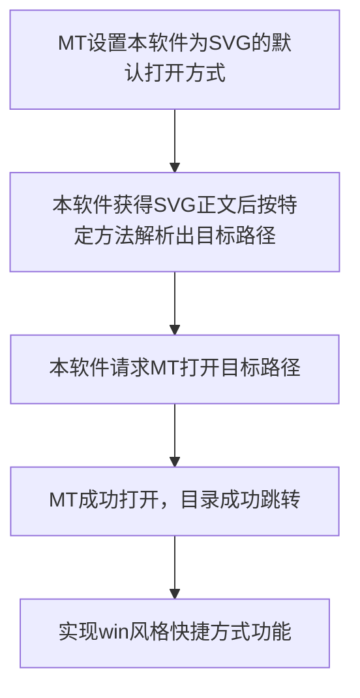

# SVG Portal - 向量传送门

~~曾用名SVG-link-for-MT-manager~~

当你使用MT管理器时，是否有想过像使用Windows时那样自定义快捷方式（MT里就是书签）的的图标？或者是做一个快捷方式大合集，把一大堆指向各种位置的快捷方式分门别类的放好？

MT管理器原版在这方面的处理简洁优雅，但也使得类似上述功能存在缺失。因此，在深度使用MT管理器很长时间后，一个实现类似功能的思路慢慢串成一线，并最终在Deepseek “V3最终版”的帮助下实现了这个软件。

使用教程(●°u°●)​ 」
1. 安装本软件。打开后会看到六个开关。事实上只有第一个开关的功能是做出来了的，其余的关掉即可。

2. 找一个好看的SVG文件，在文件的开头添加这样的东西：
```xml
<!--
target
/path/to/you/want
-->
```
3. 保存并关闭文件

4. 在MT管理器中长按文件，将本软件的"向量传送门"设置为SVG文件的默认打开方式。

5. 再次点击SVG文件，你就能发现MT目录神奇的跳转啦（｡ò ∀ ó｡）

6. MT管理器在/storage下自定义的外置SD卡模拟文件夹也可以跳转！！！/data/data/bin.mt.plus/，Android/data/等文件夹只要MT有权限访问也可以跳转。

实现过程：
```txt
事实1: MT管理器将自身注册为一种文件打开方式，其打开行为就是直接定位到该文件所在的位置
事实2: MT管理器可设置某种文件的默认打开方式
事实3: 不管SVG文件的默认打开方式为何，MT都会默认渲染出其预览图
事实4: SVG就是XML，本身就是便于编辑的文本文件，且支持注释
```
因此获得以下思路：




说明与鸣谢：
1. 本软件引用了termux-am项目的许多类，能在安卓8+版本上跳过文件有效性检验，直接命令MT打开某个路径，突破了Content链接只能关联一个"对我存在"的文件的局限。这也是本软件能指挥MT打开各种"对我不可见"的目录的原因。
2. 虚拟外置SD卡其实不是每张都打得开，主要是一些软件的文件提供不够主动，必须有一个外力把它们拉起来才能提供文件，而本软件暂时做不出那种功能。
3. 软件目前的主类用于开关软件入口，但除了了EntranceA之外其他暂时都没实现，所以这算是未来的大饼吧~
4. 本软件叫向量传送门是因为SVG是矢量图，而软件通过对SVG的特殊理解实现了目录跳转，就像让这张图片成为了传送门一样。
5. 本软件代码99% AI生成（以及引用了很多我看不懂的大佬代码(◉ω◉)），所以如果发现了什么bug欢迎报上来哈。
6. 字节的开源图标库为本项目提供了支持（0.2版本的入口B）https://iconpark.oceanengine.com/official
7. 十分感谢termux-am项目！他们开发的IActivityManager真的帮大忙了！https://github.com/termux/TermuxAm
8. image toolbox可以把任意图片转换为svg，十分推荐使用：https://github.com/T8RIN/ImageToolbox

祝您使用愉快！
